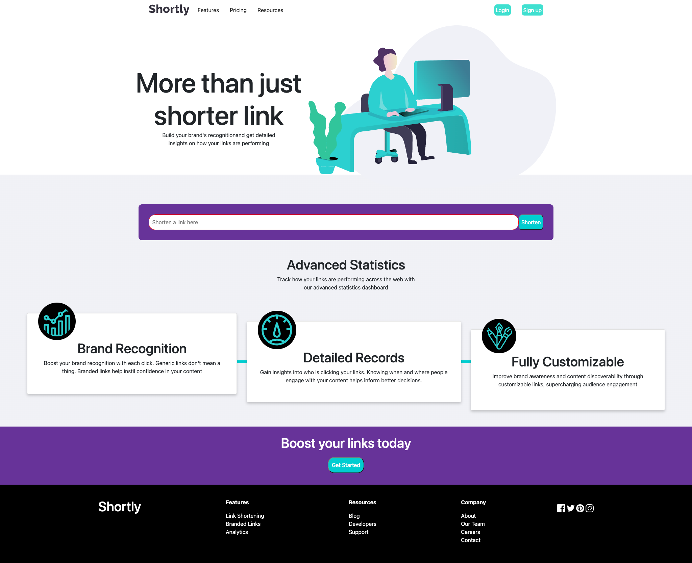
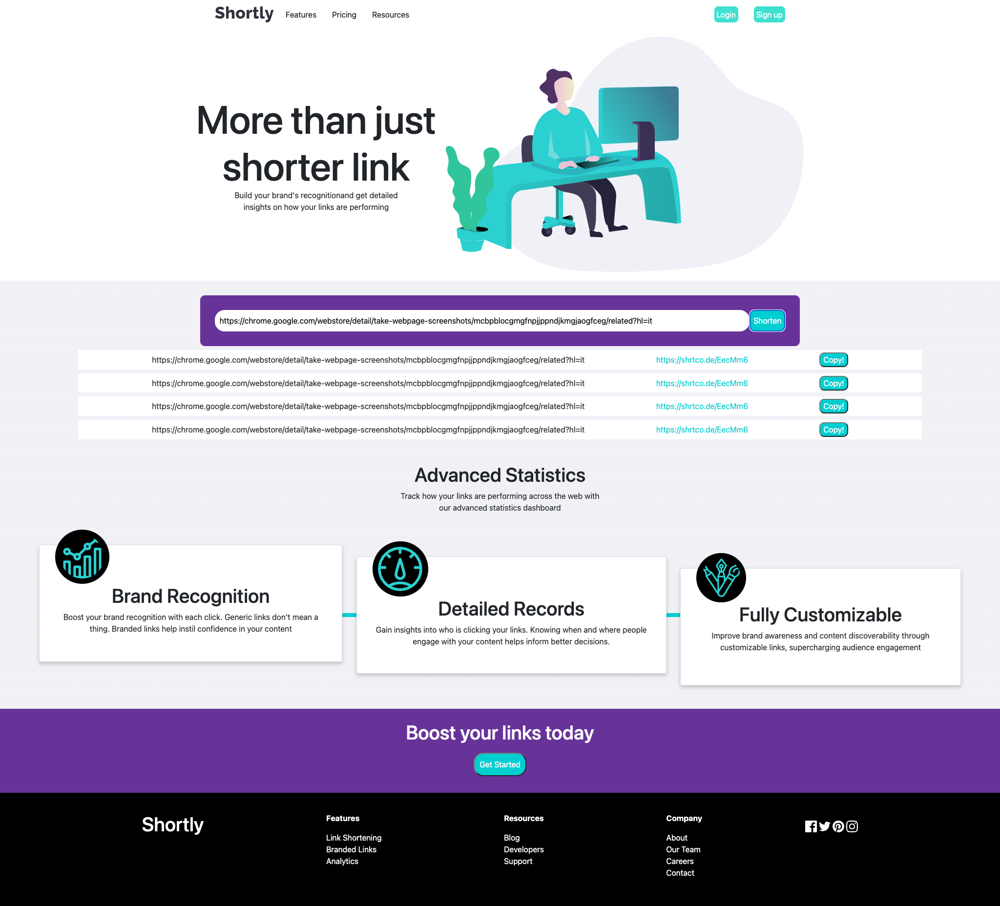
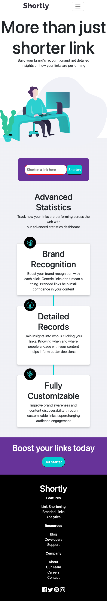

# Shortly, Link Shortener

## Overview

### The challenge

This challenge was about building a link shortener website and use an API to shorten links, I chose to develop it with vanilla technologies in order to learn the basics of web development 

### Built with

- Semantic HTML5 markup
- CSS custom properties
- Flexbox
- Mobile-first workflow
- Vanilla Javascript

### What I learned

I learned:
  - how to use semantic HTML for SEO purposes in order to allow web crawling.
  - accessbility tags for images,
  - Meta html descriptions for viewport control and SEO page description for web crawlers, for example the ones used by Google to rank pages
  - learned about CSS styling through different selectors
  - learned about basic CSS animation
  - learned about Flexbox
  - learned about Media Queries for Responsiveness
  - learned about the fetch API to retrieve content from an API
  - learned about DOM manipulation through Javascript
  - learned the basics of HTTP communication, CORS, HTTP methods and HTTP Headers

### Continued development

In future projects I'll be working with Javascript and CSS frameworks

### Results

#### Desktop version

#### Desktop links used

#### Mobile version

## Author

- Website - [Gianluca Cognigni](https://www.gianlucacognigni.com/)
- Twitter - [@kanCogs](https://twitter.com/kanCogs)